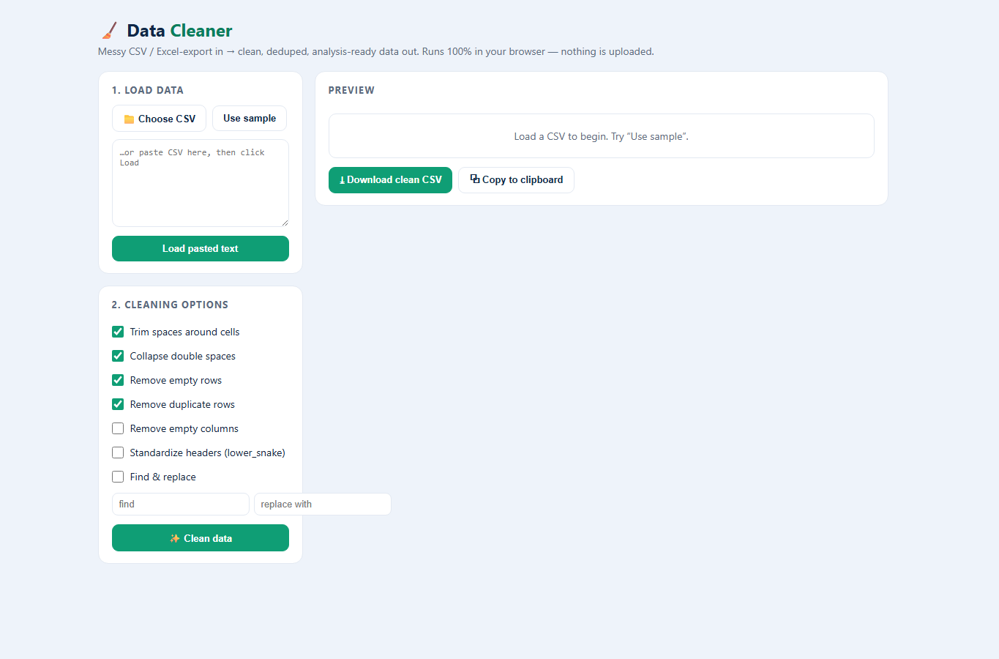

# Data Cleaner

A fast, **zero-dependency** CSV cleaning tool that runs entirely in your browser — no install, no
upload, no backend. Drop in a messy spreadsheet export, get clean, deduplicated, analysis-ready
data back. **Your data never leaves your machine.**

🔗 **Live demo:** https://ghravenlabs.github.io/Data-Cleaner-Tool/

## Portfolio proof
- [Case study](PORTFOLIO-CASE-STUDY.md) — why this tool matters, what it proves, and how it could be sold as a small data-cleanup service.
- GitHub Actions runs CSV/TSV regression tests and checks the static app, demo URL, and screenshot on every push.

## Why
Messy CSV/Excel exports are everywhere — stray whitespace, duplicate rows, empty rows, inconsistent
headers. This cleans them in one click, in pure client-side JavaScript, so it's safe for sensitive
data (nothing is ever sent to a server).

## Features
- **Load** a `.csv`/`.tsv` (file or paste), or try the built-in sample
- **Trim** whitespace · **collapse** double spaces · **remove empty rows** · **remove duplicate rows**
- **Remove empty columns** · **standardize headers** (`lower_snake_case`) · **find & replace**
- **Live preview** (before/after) with row/column counts and a summary of exactly what changed
- **Export** the cleaned CSV or copy to clipboard
- Robust CSV parser (handles quoted fields, embedded commas/newlines, auto-detects comma vs tab)

## Tech
- **Vanilla HTML/CSS/JavaScript** — no frameworks, no build step, no dependencies
- Custom CSV parse + serialize (quote-aware), in-browser only
- Single self-contained file → works offline and deploys anywhere static

Delimiter detection uses the first logical row (the headers), ignoring separators inside quoted
fields. Comma is the default when the header is ambiguous. Use consistent column separators;
automatic detection cannot disambiguate every malformed or mixed-format file.
Empty-column removal checks the widest row, so populated cells beyond a short header
are retained. Missing header names and cells are exported as empty strings.

## Development checks

With Node.js 24 installed, run `node --test tests/csv.test.cjs`. The tests exercise the app's
actual parser and exporter using Node's built-in test runner; no package install is needed.

## Run it
- **Locally:** open `index.html` in any browser.
- **Deploy:** push to GitHub and enable **Pages** (Settings → Pages → deploy from `master`) — it's a
  static site, so it just works.

## Privacy
100% client-side. No analytics, no network calls, no uploads. Your CSV is processed in the page and
discarded when you close the tab.

## License
MIT © Rolly Calma ([Ghraven](https://github.com/Ghraven))
